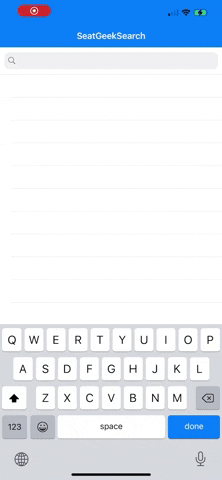

# FetchRewardsTest
iOS Coding exercise issued by FetchRewards. 

Thank you so much for checking out the project that I made for this coding exercise! I had a lot of fun putting this together and adding my own little bit of spice in areas that I felt could use it. 

## Here is a what I built, with screenshots
- The first view is a UITableViewController that uses a UISearchBar to make an network call to the SeatGeek API and fetch events for the search term.
- The events return displayed with information relevant to the user. 
- An event that the user has favorited will appear with a small red heart.
- An added piece of flair from myself was adding a little tag, denoting what type an event is ("NHL", or "CONCERT" etc).

